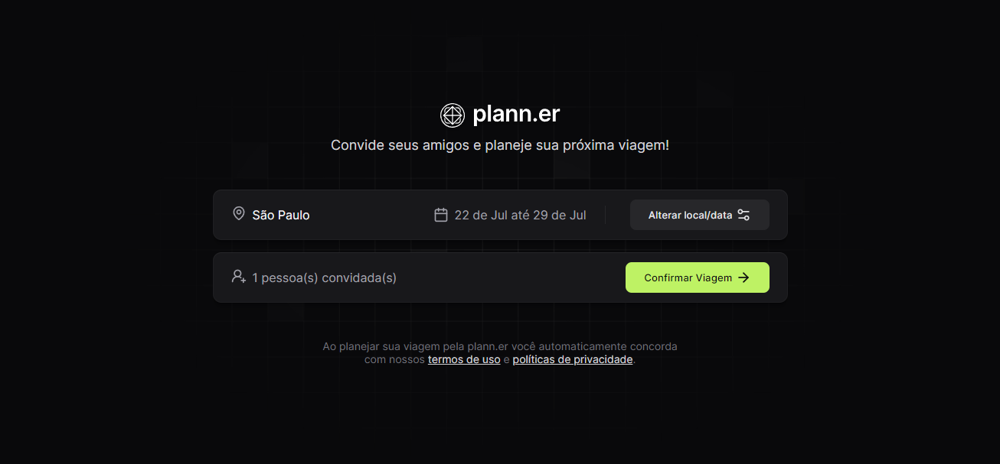

# Plann.er


<p align="center">
    
</p>

<p align="center">
    <a href="#about">About |</a> 
    <a href="#started">Getting Started</a> 
    <a href="#routes">| App Routes</a> 
</p>

<h2 id="about">📌 About</h2>

Plann.er is a travel planner developed during Rocketseat's NLW Journey. This application allows users to organize their trips efficiently, including entering locations, managing guests, and organizing dates and times. Built with React and TypeScript, Plann.er uses web development best practices to create an intuitive and responsive user experience.

<h2 id="started">🚀 Getting started</h2>

For this project, several libraries were used, such as:

-    Lucide React
-    React Router Dom
-    React Day Picker
-    Axios

<h3>Cloning</h3>

```bash
git clone https://github.com/RafaelHDSV/Plann.er.git
npm install
```

<h3>Starting</h3>

```bash
cd Plann.er
npm start
```

<h2 id="routes">📍 Application Routes</h2>

In the project there is a backend, where specific routes are created for each trip, such as:
​
| route | description  
|----------------------|-----------------------------------------------------
| <kbd>/</kbd> | new trip page
| <kbd>/trips/:tripId</kbd> | trip details page

<hr/>

### route: <kbd>/</kbd>



<hr/>

### route: <kbd>/trips/:tripId</kbd>


<hr/>
